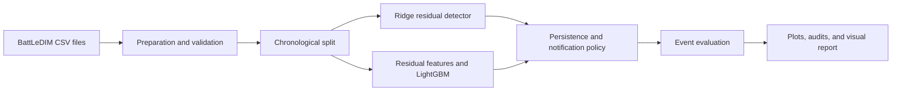

# Water Watch

Water Watch is a Python research prototype for detecting leaks in water-distribution networks from pressure and flow measurements. It prepares the BattLeDIM benchmark, trains detectors, generates alarms, evaluates them against individual leak events, and produces a browser-readable visual report.

The intended final system will explain alarms and route suggested actions through human approval. SHAP explanations, the LangGraph approval workflow, and the Streamlit dashboard are not implemented yet. The current system is a batch command-line pipeline with saved reports, not a live monitoring service.

## System Overview



The Ridge baseline predicts each pressure sensor using other sensors and time-of-day features. Its actual-minus-predicted residuals measure unexpected behavior. Sustained abnormal scores trigger alarms; recovery and cooldown rules reduce repeat notifications. LightGBM is a separate experimental detector whose first run did not generalize to later leaks. No LLM currently participates in detection.

Current implementation status:

- Phase 1 data pipeline scaffold is implemented.
- Phase 2 residual baseline workflow is implemented and produces a saved model, test scores, alarms, and a leak-overlay plot.
- Phase 3 experimental LightGBM detector and Phase 4 event evaluation are implemented. The first LightGBM run did not improve detection; the baseline remains the working detector.
- Baseline notification de-duplication and a standalone HTML visual report are implemented.

## Setup

Tested with Python 3.11 on Windows. Clone this repository and enter its folder:

```powershell
git clone https://github.com/shivam3746/water-watch.git
cd water-watch
```

```powershell
python -m venv .venv
.\.venv\Scripts\Activate.ps1
python -m pip install -r requirements.txt
```

Activation is optional when using `.\.venv\Scripts\python.exe` directly. On Linux/macOS, use `.venv/bin/python`. For a smoke test without dataset downloads, run `scripts/phase2_baseline.py --demo` as documented below.

## Data

Place BattLeDIM sensor data in `data/raw/`. The Phase 1 loader expects a CSV with:

- A timestamp column such as `timestamp`, `time`, `datetime`, or `date`.
- Pressure sensor columns, preferably named with `P...` or containing `pressure`.
- Flow sensor columns, preferably named with `F...`, `Q...`, or containing `flow`.
- A leak label column such as `leak`, `leak_label`, `is_leak`, or `label`.

Update `config.yaml` if your filenames or column names differ. The default configuration now points to `data/processed/battledim.csv` produced by the preparation command below.

### Official BattLeDIM Files

Download `2018_SCADA_Pressures.csv`, `2018_SCADA_Flows.csv`, and `2018_Leakages.csv` from the [official BattLeDIM release](https://zenodo.org/records/4017659), place them in `data/raw/`, then run:

```powershell
.\.venv\Scripts\python.exe scripts/prepare_battledim.py
```

This reads the official semicolon-separated, decimal-comma format, checks unique aligned five-minute timestamps and finite values, and writes `data/processed/battledim.csv` plus `data/processed/battledim.summary.json`. Pressure columns receive `pressure_` prefixes and flow columns receive `flow_` prefixes, preserving original identifiers in the summary mapping. Source CSV files are retained.

BattLeDIM is a simulated water-network benchmark, not an operating utility's live sensor feed. Downloaded data, prepared CSVs, trained models, generated reports, virtual environments, and local secrets are excluded from Git. They remain on your machine and can be regenerated with the documented commands. Consult the original dataset release for attribution and usage terms.

The binary label is 1 whenever any pipe leakage value is strictly positive. In the supplied 2018 data, 102,810 of 105,120 rows (97.8%) are positive and overlapping pipe leaks form one network-wide episode. This label is useful for plotting ongoing leakage but cannot distinguish individual incidents. Event evaluation must use the original per-pipe leakage records for onset, repair, and overlap matching; accuracy cannot be inferred from the plot alone.

## Phase 1 Exploration

```powershell
python scripts/phase1_exploration.py --config config.yaml
```

This command:

- Loads the configured dataset.
- Reports structure and missing values.
- Performs a chronological train/test split.
- Saves representative pressure and flow plots with true leak intervals shaded to `artifacts/plots/`.

## Tests

```powershell
pytest
```

If `pytest` is not on PATH, use:

```powershell
python -m pytest
```

## Phase 2 Baseline

Run these commands from the project folder. Activation is optional when using the explicit Python path.

First, check the complete workflow with seeded synthetic five-minute data:

```powershell
.\.venv\Scripts\python.exe scripts/phase2_baseline.py --demo
Invoke-Item artifacts/baseline/demo/baseline_alarms.png
Get-Content artifacts/baseline/demo/baseline_summary.json
Get-Content artifacts/baseline/demo/baseline_alarms.json
```

For official real data, run the preparation command above; `config.yaml` already points to the merged output. For another merged CSV, set `data.raw_path` and the column names in `config.yaml`. Leak labels should be 0 or 1. Then run:

```powershell
.\.venv\Scripts\python.exe scripts/phase2_baseline.py --config config.yaml
Invoke-Item artifacts/baseline/baseline_alarms.png
Get-Content artifacts/baseline/baseline_summary.json
Get-Content artifacts/baseline/baseline_alarms.json
.\.venv\Scripts\python.exe -m pytest
```

Check that `train_end` precedes `test_start` in the summary. The plot shows the test anomaly score, threshold, red true-leak intervals, and green alarm markers. An empty alarm list is a valid result when no episode meets the configured rules. Demo results confirm execution, not real-world detection accuracy.

Each run writes these files to `baseline.output_dir` (default `artifacts/baseline`); demo runs use its `demo` subfolder. Use `--output-dir artifacts/baseline/run2` to keep another run separately:

- `baseline_model.joblib`: fitted detector for later inference.
- `baseline_residuals.csv`: signed actual-minus-predicted pressure per sensor.
- `baseline_sensor_scores.csv`: rolling absolute residuals normalized by training residual standard deviation.
- `baseline_scores.csv`: mean sensor anomaly score and fixed threshold per test timestamp.
- `baseline_alarms.json`: deterministic alarm IDs, timestamps, scores, and top contributing pressure sensors.
- `baseline_alarms.png`: alarms plotted against true leak intervals.
- `baseline_summary.json`: split boundaries, effective settings, threshold source, cadence, and alarm count.

`rolling_window` is a sample count: 6 samples on five-minute data covers 30 minutes. `persistence_hours` is elapsed time from the first observed above-threshold sample: 3 hours requires 37 consecutive five-minute observations. One alarm is emitted per uninterrupted episode; a score at or below threshold or a gap longer than 1.5 times the median training cadence resets persistence. Residual rolling averages use available samples at the start of the test period.

With `threshold: null`, the threshold is the configured quantile of rolling training scores (`threshold_quantile: 0.995`). Ridge models, residual scales, and thresholds use training sensor data only; labels are only used for plotting. Training includes the entire training period, so leaks in that period can affect calibration. Set a fixed threshold only using training data or a separate chronological validation period. Missing or infinite sensor readings must be cleaned before running; the detector fails with an actionable error instead of interpolating using future data. Automatic calibration currently uses in-sample training residuals and may yield optimistic thresholds; event evaluation below measures the held-out result.

Load a model produced by this project for independent inference:

```python
import joblib
from src.data.loader import load_sensor_dataset

dataset = load_sensor_dataset("data/processed/battledim.csv")
detector = joblib.load("artifacts/baseline/baseline_model.joblib")
scores = detector.score(dataset.frame[dataset.sensor_columns].iloc[-100:])
alarms = detector.create_alarms(scores)
```

## Phases 3 and 4: LightGBM and Event Evaluation

Install the updated requirements, then regenerate both detectors and the comparison in one command:

```powershell
.\.venv\Scripts\python.exe -m pip install -r requirements.txt
.\.venv\Scripts\python.exe scripts/run_comparison.py --config config.yaml
Get-Content artifacts/results/evaluation/comparison.md
Invoke-Item artifacts/lightgbm/lightgbm_alarms.png
.\.venv\Scripts\python.exe -m pytest
```

The prepared dataset must already exist. The command trains the baseline, trains LightGBM, selects its threshold on chronological validation, and evaluates both on the same held-out test period. The original run held out this period; subsequent 2018 follow-up comparisons are exploratory because its results have now been inspected. To train only LightGBM or re-evaluate existing saved alarms:

```powershell
.\.venv\Scripts\python.exe scripts/train_lightgbm.py --config config.yaml
.\.venv\Scripts\python.exe scripts/evaluate_detectors.py --config config.yaml
```

LightGBM uses signed residuals, trailing residual mean/std/max/absolute max, pressure and flow changes, hour-of-day, and aggregate residual/score (205 features with the supplied sensors). All windows are trailing, and test features use only current/past sensor observations. The classifier's own Ridge model is fitted on the earliest 50% of the outer training period; the next 30% trains LightGBM; the final 20% selects a threshold. The final 30% of the full dataset remains the test set. These fractions are configurable and disjoint. The baseline comparison model still uses the entire outer training period, as in Phase 2.

**Target definition:** because general leak-presence labels are positive for 97.8% of 2018, the classifier instead predicts the first 24 hours of a newly started pipe leak while that pipe remains active. Existing source-boundary leaks are excluded from new-onset labeling. This is a new-event detector, not a classifier for every moment of ongoing leakage. `classifier.onset_window_hours` controls this target; `evaluation.max_detection_delay_hours` is also set to 24 to evaluate the same task. Choose task definitions and settings before looking at test outcomes.

Threshold candidates are selected by validation event F1, then fewer false alerts, then higher threshold as deterministic tie-breaks. Test labels never influence fitting or selection. Output probabilities are uncalibrated model scores; the model is deterministic with a fixed seed and one CPU thread (see [LightGBM parameter documentation](https://lightgbm.readthedocs.io/en/latest/Parameters.html)).

Saved LightGBM artifacts in `artifacts/lightgbm/` include the complete reloadable `lightgbm_model.joblib`, native `lightgbm_booster.txt`, trailing `feature_history.csv`, probability/threshold CSV, standard alarm JSON, plot, feature-gain CSV, validation threshold audit, and run summary. The native booster alone requires the same Ridge model and feature construction. Alarm sensor hints currently rank baseline residual scores; they are not SHAP explanations or proven physical locations.

For independent inference with the complete saved model:

```python
import json
import joblib
import pandas as pd
from src.data.loader import load_sensor_dataset

model = joblib.load("artifacts/lightgbm/lightgbm_model.joblib")
summary = json.loads(open("artifacts/lightgbm/lightgbm_summary.json").read())
dataset = load_sensor_dataset("data/processed/battledim.csv")
test = dataset.frame.loc[summary["test_start"]:, model.sensors]
history = pd.read_csv("artifacts/lightgbm/feature_history.csv", index_col="timestamp", parse_dates=True)
scores = model.score(test, history=history)
alarms = model.create_alarms(scores)
```

### Evaluation Rules and Artifacts

The evaluator extracts separate positive leakage runs for each pipe using the full ground truth, preserving their original onset even when they cross the train/test boundary. Each interval is `[first_positive, first_zero)`; an event active at the source end is marked censored.

- New events starting in the test period enter recall. Events already active at the split, or with an unknown source-boundary onset, are retained in the audit but excluded from onset recall/delay.
- Each chronological alarm can match one active unmatched event, before the exclusive 24-hour deadline. Overlaps select the earliest deadline deterministically and are flagged when ambiguous. This measures temporal association, not pipe localization.
- Additional alarms during an already detected event are duplicates and count as false alerts. Unmatched alarms, alarms before onset, late alarms, and alerts attributable only to carry-in events also count as false alerts for the new-onset task. That does not prove the network was leak-free.
- Missed events have null delay. Mean detection delay includes detected events only. Events starting near the test end remain eligible with their truncated follow-up marked as censored.
- False alerts per week divides by the full regular test observation duration, including the last sample interval. Empty-denominator precision/recall/F1 are zero; no detected-event mean delay is null.

`artifacts/results/evaluation/` contains `comparison.csv`, `comparison.md`, and `evaluation.json` with per-model metrics, audits, and available run manifests. `model_1_events.csv`/`model_1_alarms.csv` correspond to the first model (baseline by default), and `model_2_*.csv` to the second (LightGBM). Configure `evaluation.alarm_paths` for additional saved detectors. Existing run manifests must match the current split, or evaluation asks you to regenerate the models.

### First 2018 Results

The held-out interval is 2018-09-13 12:00 through 2018-12-31 23:55. It has two new leak events and four carry-in leaks excluded from onset recall.

| Detector | Precision | Recall | F1 | Mean Delay (Hours) | False Alerts/Week |
| --- | ---: | ---: | ---: | ---: | ---: |
| Residual baseline | 0.222 | 1.000 | 0.364 | 4.46 | 0.447 |
| LightGBM | 0.000 | 0.000 | 0.000 | N/A | 0.000 |

The baseline detected the two new events with delays of 3 hours and 5 hours 55 minutes, then produced seven repeat alerts. LightGBM emitted zero test alarms and missed both events. Its validation audit also detected zero events at every configured candidate threshold, so it has not established useful detection or successful calibration. Keep the baseline as the working detector. Two test events are too few for broad accuracy claims, and timing matches do not establish physical localization. The next model investigation should use training/validation data or a fresh holdout, without tuning against these test leaks. Explainability and the human-review workflow are still pending.

## Alarm De-duplication Follow-up

The baseline now supports `recovery_hours` and `cooldown_hours`. Both default to zero in the Python API for legacy replay; `config.yaml` enables 24 hours for each. After a notification, the incident stays open until 24 continuous hours of normal scores. A new notification also requires the cooldown to expire and the original high-score persistence rule to be met. Missing values and gaps reset recovery evidence, not the open incident. Recovery is score-based and uses no leak labels. This policy can suppress separate leaks while an incident is open; it does not establish pipe-level incident identity or cross-call streaming state.

To compare the preserved legacy baseline against the new policy without retraining or overwriting the original artifacts:

```powershell
.\.venv\Scripts\python.exe scripts/compare_alarm_policies.py --config config.yaml
Get-Content artifacts/results/alarm_deduplication/comparison.md
Invoke-Item artifacts/results/alarm_deduplication/report.html
```

The single-file visual report shows the score/threshold, a full-period view and individual-event details, retained/suppressed markers, and a notification audit. It opens directly in a browser; no development server is needed. Refresh it after rerunning the command. The report shows completed batch results, not a live sensor stream.

**Fresh-checkout prerequisite:** this command needs an existing legacy baseline with de-duplication disabled. Set `baseline.recovery_hours` and `baseline.cooldown_hours` to `0` in `config.yaml`, run `phase2_baseline.py`, restore both values to `24`, then run `compare_alarm_policies.py`. Do this before the normal `run_comparison.py` if you want to retain the legacy comparison; the standard configuration already enables de-duplication. A de-duplicated source cannot be replayed as a legacy source.

The replay writes a separate model, alarm list, and manifest to `artifacts/baseline_deduplicated/`. On the inspected 2018 test slice, nine notifications become two, precision rises from 22.2% to 100%, recall stays 100%, and mean delay stays 4.46 hours. This is an exploratory alarm-policy result on two known events, not a fresh accuracy estimate. The original files in `artifacts/baseline/` remain unchanged by this command. A later `run_comparison.py` run uses the new policy and overwrites its standard output directories; preserve the legacy run before doing that if you need to repeat this comparison.

See `docs/DETECTION_IMPROVEMENT_PLAN.md` for the follow-up order, validation cautions, target alternatives, and the 2019 holdout. Change detection, blocked validation, revised regression targets, and simulation are not implemented yet.

## Repository Layout

```text
config.yaml                    Data paths and detector settings
requirements.txt               Python dependencies
scripts/                       Preparation, training, evaluation, report commands
src/data/                      Loading and preprocessing
src/detection/                 Ridge, LightGBM, features, alarm policies
src/evaluation/                Event metrics and comparison plots
src/agent/schemas.py            Shared Alarm representation
tests/                         Correctness and regression tests
docs/                          Follow-up experiment protocol
notebooks/                     Exploration entry point
data/raw/                      Source downloads (ignored)
data/processed/                Prepared datasets (ignored)
artifacts/                     Generated models, plots, audits, reports (ignored)
```

Tests cover chronological separation, aligned ground truth, causal features, alarm persistence and recovery, deterministic replay, model reload, event matching/delays, preservation of legacy artifacts, and independence from unseen test labels. Passing tests verifies implementation behavior, not detection accuracy.

## Development Priorities

1. Data correctness
2. Baseline residual detector
3. Evaluation
4. LightGBM detector
5. SHAP explanation
6. Human-in-the-loop incident agent
7. Streamlit demo

## License

Project code is licensed under the [Apache License 2.0](LICENSE). The BattLeDIM dataset is distributed separately by its original authors; consult its source release for attribution and usage terms.
