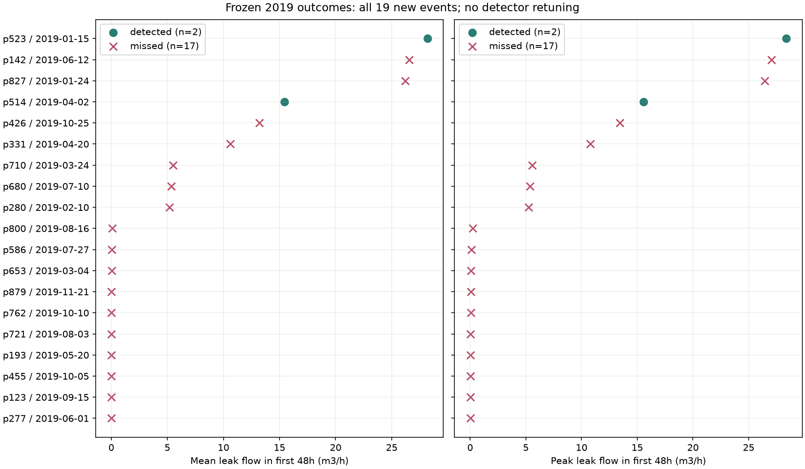
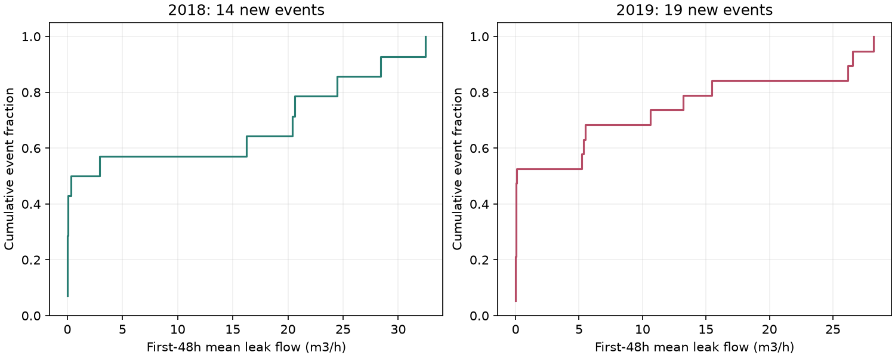
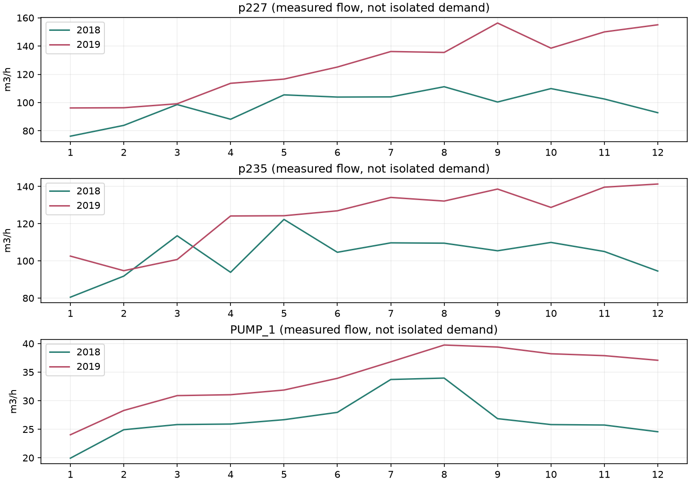

# Frozen 2019 Misses and Year-to-Year Conditions

Exploratory post-test diagnostics, recorded 10 October 2026. No refitting,
recalibration, alarm-policy change or rescoring of outcomes. All frozen final
output hashes are unchanged. Diagnostic notification replay exactly reproduces
the two saved 2019 notification timestamps, including late-2018 warmup state.

## Leak Size

All 19 new events are plotted; four carry-in events are excluded from onset recall.
Size is the mean/peak pipe leakage during [onset, min(onset + 48h, end, year end)).
This uses retrospective labels for diagnosis, never detector inputs. Observed
full-event peaks are secondary, may occur after the matching deadline, and may
be right-censored. No favourable size cutoff was selected.

- Detected: 2 events; median early mean flow 21.82 m3/h.
- Missed: 17 events; median early mean flow 0.05 m3/h.
- Largest detected early mean: 28.19 m3/h.
- Largest missed early mean: 26.57 m3/h.

The observed size ordering is descriptive only; two detections cannot establish size sensitivity.
However, 2 missed events exceed the
smaller detected event (15.45 m3/h).
Thus leak size alone does not explain the observed outcomes. In particular,
large missed events must be considered alongside notification-state blocking.

## Notification State

14/17 missed events began while an incident was
already open. In 14/17 missed-event windows,
the score reached the frozen three-hour persistence criterion but an open
incident blocked a new notification. Windows can overlap; this does not mean
each eligible score run is caused by that pipe or that removing suppression
would produce a valid localized detection. It identifies a conflict between
incident-level de-duplication and new-onset recall, not a new performance estimate.

## Yearly Conditions

The identical frozen model's median score is 0.767
on 2018 fitting data and 1.735 in 2019. Score exceedance
changes from 0.5% to
74.9%. The fitting exceedance rate reflects
the quantile chosen on that same data; this is not a fair generalization test.
17 pressure sensors have an absolute
yearly mean shift exceeding one 2018 standard deviation.

| Flowmeter | 2018 Mean (m3/h) | 2019 Mean (m3/h) | Shift / 2018 SD |
| --- | ---: | ---: | ---: |
| p227 | 98.20 | 126.68 | 0.95 |
| p235 | 103.50 | 124.14 | 0.66 |
| PUMP_1 | 26.84 | 34.13 | 0.34 |

Each meter is considered separately, not summed (pump flow can duplicate network
movement). Raw inlet flows contain demand, leakage and operational effects.
Without AMRs and operating controls this is not proof of changed consumption.
The sensor audit also reports matched month/hour profile differences, daily-mean
KS distances without IID p-values, and repeated-value fractions (not fault labels).

The 14 full-year 2018 new-event size references
have median early mean flow 1.62 m3/h,
versus 0.09 for 2019. This 2018 descriptive
reference is not the nine-event development evaluation. Raw condition differences
and fitting-vs-test residual changes do not distinguish distribution shift,
leak contamination, operating changes and overfitting causally.

## Hypothesis and Falsifiable Next Study

Conditional pressure residuals may absorb common leak responses because other
pressure sensors and flows are predictors. Shifted conditions may keep scores
elevated, while recovery-based de-duplication prevents separate onset notifications.
These are competing, potentially interacting hypotheses, not established causes.

Build paired nominal/leak WNTR simulations with controlled leak size/location,
demand uncertainty and pump/valve regimes. Compare hydraulic-model residuals
against the current conditional residuals under the same recorded protocol;
report event recall by predeclared size bands, false alerts and missed-inclusive
delay summaries. Separate ablations for residual model and notification policy.
Hold out locations, demand regimes and an independent network/year; validate
simulation realism against observed sensor statistics. Do not retune on observed
2019 and describe it as an untouched final test.

Sources: [official BattLeDIM dataset](https://zenodo.org/records/4017659),
[official units/conditions](https://battledim.ucy.ac.cy/wp-content/uploads/2020/01/BattLeDIM_Problem_Description_and_Rules-v1.3.pdf),
[WNTR documentation](https://usepa.github.io/WNTR/userguide.html).
Dataset-derived content: CC BY 4.0. No supervisor-specific alignment is claimed
without the actual DC10 project description.
